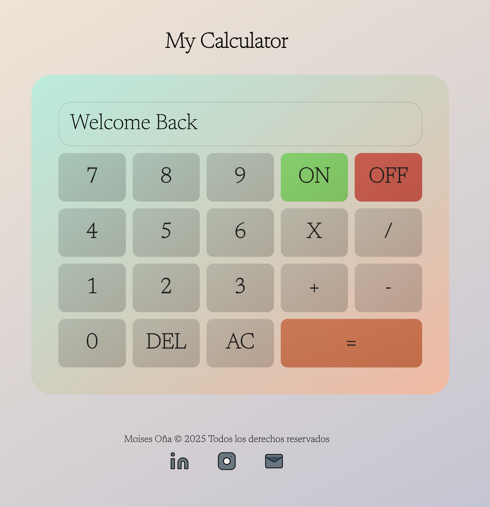
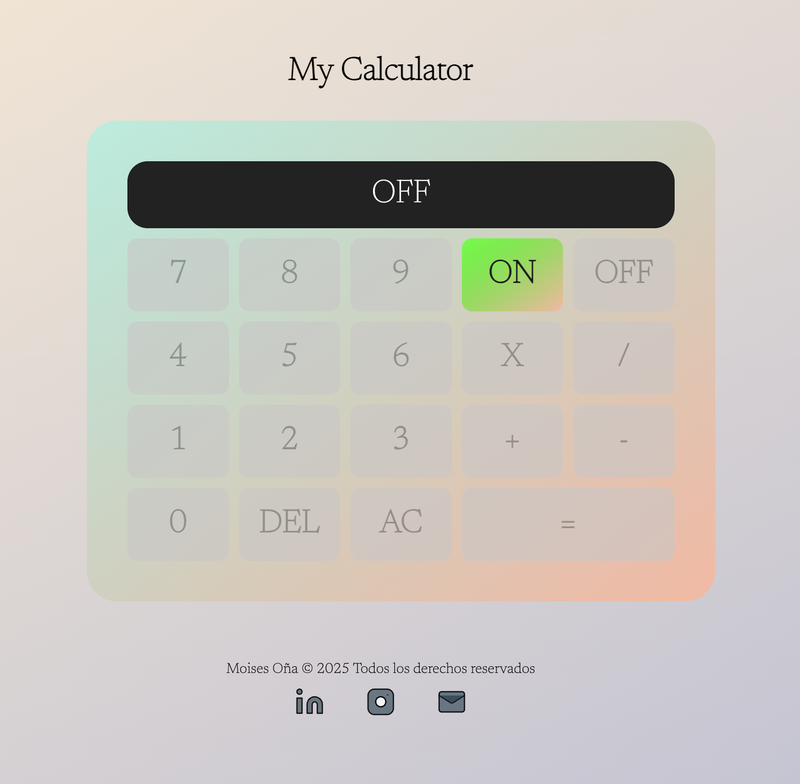
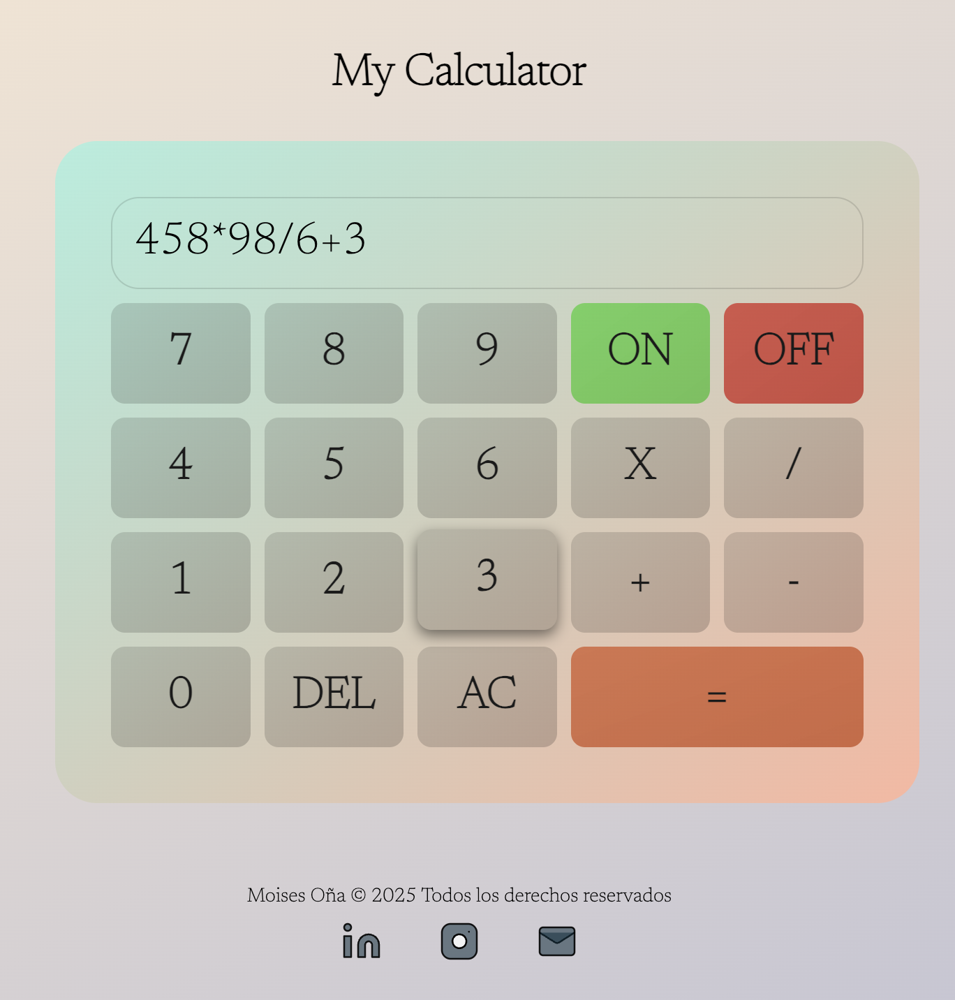
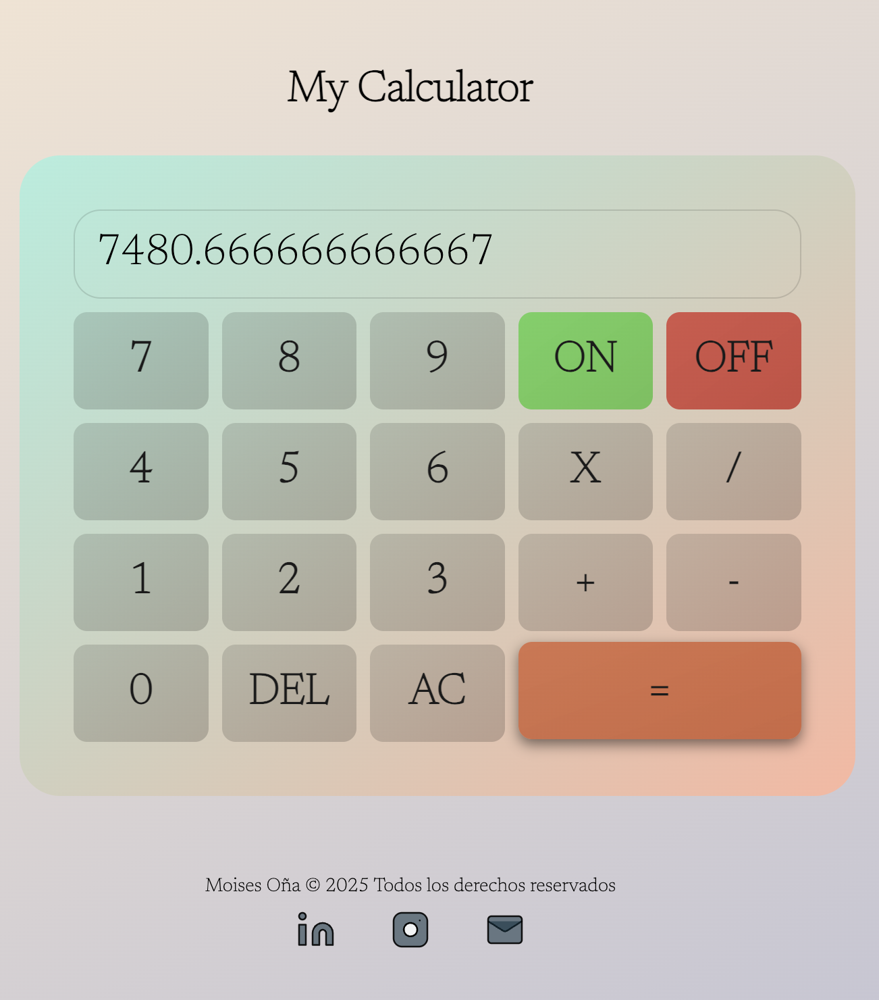

# 🧮 JS Calculator

Calculadora creada en JavaScript puro (sin `eval()`), capaz de realizar operaciones básicas respetando jerarquía matemática (*, /, +, -).

---

## 🚀 Funcionalidades

✔ Encendido y apagado (ON / OFF)  
✔ Botones DEL (borrar) y AC (reset total)  
✔ Operaciones con prioridad matemática  
✔ Diseño responsive con CSS / SCSS (sin frameworks)

---

## 🛠️ Tecnologías usadas

- **HTML**
- **CSS / SCSS**
- **JavaScript**

---

## ⚡ Vista previa

### 🔵 ON

### 🔴 OFF

### ➕ Operaciones

### ✅ Resultado

---

## 📌 Autor

Moises Oña © 2025 — Todos los derechos reservados.